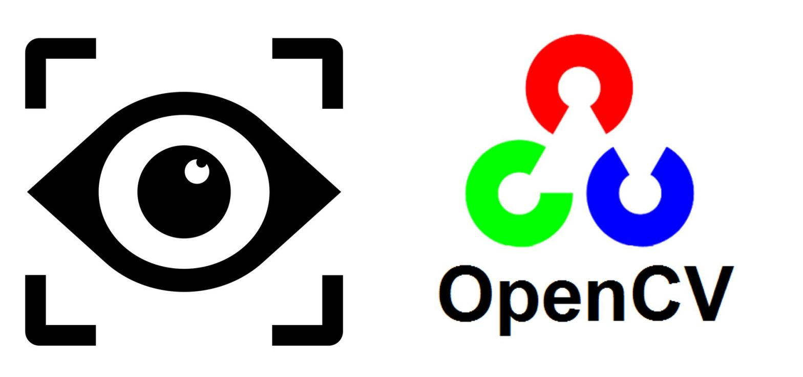

# OpenCV Image Pre-processing

A collection of pre-processing algorithms for a machine learning Optical Character Recognition (OCR) pipeline

## Project Specifications

- Developed in Python
- Utilizes [OpenCV](https://opencv.org/): a library aimed at computer vision A.I.
- Gray-Scale Conversion
- Noise-Removal
- Normalization
- Image-Resizing
- Skew Correction
